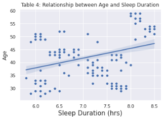

# Predicting-Sleep-Metrics
### Data Science Fundamentals - Individual Project 
### Peter Nguyen
### December 2, 2023

## 1. Introduction
The objective of this project is to implement a multiple linear regression model that effectively predicts how many hours of sleep a person is getting and the quality of their sleep. This prediction will be based on a set of specific factors, allowing us to gauge the influence of these elements on sleep patterns and provide insights into the person's sleep metrics.

Sleep is a vital aspect of overall health and well-being, influencing various physiological and psychological functions. Understanding the factors affecting sleep patterns and their implications on health is crucial. The Sleep Health and Lifestyle Dataset aims to provide insights between sleep metrics, and lifestyle factors among individuals.

While the dataset is synthetic, the analysis aims to mirror real-world scenarios, offering illustrative findings that may be extracted and interventions in the field of sleep health.

In pursuit of implementing a prediction model using multiple linear regression, I utilized [w3schools](https://www.w3schools.com/python/python_ml_multiple_regression.asp)\[3], [Geeksforgeeks](https://www.geeksforgeeks.org/learning-model-building-scikit-learn-python-machine-learning-library/)\[4], and [Scikit-learn](https://scikit-learn.org/stable/modules/generated/sklearn.metrics.r2_score.html)\[5] as resources to gain an understanding of the process.

By delving into a wide range of variables, I seek to unravel the intricate dynamics that contribute to variations in sleep patterns.
### 1.1 Objectives/Research Questions
1. How well does the multiple linear regression model predict how many hours of sleep a person gets based on lifestyle and health factors?

2. Can the model be extended to predict Sleep Quality?

3. How do Exercise, Stress Level, and Age influence Sleep Duration and Sleep Quality? What are their relationships?

## 2. Data Selection
The Sleep Health and Lifestyle Dataset, presented in this report, is a synthetic dataset, acknowledging its origin as a product of artificial generation rather than real-world observations. 

The dataset is derived from [Kaggle](https://www.kaggle.com/datasets/uom190346a/sleep-health-and-lifestyle-dataset/)\[1], comprising of 400 rows and columns, the dataset encapsulates a diverse array of variables, including sleep metrics, and different lifestyle factors. The factors the data provided includes sleep duration, sleep quality, physical activity levels, stress, and age. 

The authors states that the dataset also utilizes methods like filling in missing values and crafting new variables to mimic real-life situations. Imputation was also used to handle missing data and enhance the dataset’s completeness, while feature engineering involved crafting additional variables to make the dataset more comprehensive. 

The model training is implemented in Jupyter and is available .

Data Preview:

I have intentionally chosen a subset of columns from the dataset, specifically focusing on those that exclusively contain numerical values.

## 3. Methodology
Tools Used:
* Pandas
* Matplot
* Seaborn
* Scikit-learn
  * Sklearn.metrics - r2_score
  * Sklearn.mode_selection - train_test_split

Scikit Model Implemented:
Multiple Regression Model

In this analysis, we employed multiple linear regression as a statistical method to explore the relationship between multiple independent variables and a dependent variable. Multiple linear regression allows us to model the impact of several factors simultaneously, providing insights into their collective influence on the target variable. We chose this method for its versatility and ability to handle complex relationships in my dataset. The model assumes that each data point varies independently from others, recognizing that in reality, there may be situations where variation isn’t always present. To implement the multiple regression model, we utilized the ‘linear_model’ module in Scikit-learn’s library in Python. The ‘LinearRegression()’ function from Scikit-learn was also used to train and predict data. This function significantly contributed to shaping my analysis.

### 3.1 Variables
The dataset encompasses variables such as age, sleep duration, sleep quality, physical activity level, stress levels, BMI category, blood pressure, heart rate, daily steps, and the existence or lack of sleep disorders. For the purpose of this study, I focused on the complexity of the relationships between age, exercise, stress levels, and sleep quantity & quality.

### 3.2 Relationship Exploration

To provide an initial overview and visually inspect potential relationships among the selected variables, a pairplot was generated. The pairplot visually presents scatter plots for each relationship and histograms for individual variables along the diagonal. This visualization aids in the identification of patterns and potential correlations between lifestyle factors and sleep metrics. 

## 4. Results
After the analysis, I calculated the accuracy of my model. The accuracy metric provides an overall measure of how well the model’s predictions align with the actual values in the dataset. As a key metric for determining the accuracy of the implemented model, I used R2. The calculated R2 values provided insights into the variability between the model’s predictions and the actual data.

Sleep Duration Prediction Accuracy(%):

The R2 value of 0.74 indicates that the model can predict a person’s sleep hours with an accuracy of 74%. In other words, 74% of the variability in sleep hours is explained by the model's predictions.

Sleep Quality Prediction Accuracy(%):

The R2 value of 0.88 indicates that the model can predict a person’s sleep quality scale with an accuracy of 88%. The model accurately predicts a person's quality of sleep 88% of the time based on the calculations.

### 4.1 Visualizations
#### 4.11 Sleep Duration Trends

Upon analyzing the graph, the relationship between exercise and sleep duration appears to be relatively flat. The non-linear orientation of the line of best fit suggests a limited linear correlation between these variables. External factors such as intensity and timing of exercise may contribute to the shaping relationship between exercise and sleep length.

The variable stress level was chosen based on its impact on sleep duration. Notably, there is a negative linear correlation between stress levels and sleep duration. The trend indicates that, on average, lower stress levels are associated with increased sleep duration. This finding aligns with the concept that reduced stress may positively impact sleep, potentially through reduced sleep disturbances which can be caused through stress.

Observing the visualization, there is a somewhat linear relationship which suggests that there is a tendency for sleep duration to vary with age. This finding explores age-related factors that could influence sleep patterns, such as physiological changes or shifts in lifestyle habits. While there is a somewhat linear relationship, health conditions may come with age, contributing to the overall variability in sleep duration.

#### 4.12 Quality of Sleep Trends

Upon analyzing the scatter plot and the corresponding line of best fit, a somewhat linear relationship suggests that as individuals engage in more physical activity, the higher sleep quality they get. While the linear relationship is evident, other factors should be considered, such as stress and individual differences that may contribute to the overall variability in sleep quality.

In the visualization, we can extract a distinct negatively linear relationship between the sleep quality and the stress levels of a person. While the observed negative linear relationship between stress and quality of sleep is present, it should also be taken into account how sparse the data points are in the scatter plot. The limited number of data points may affect the accuracy of the linear trend observed. Further studies with larger and more diverse datasets are recommended to strengthen the reliability of the observed relationship.

Although we observe a linear relationship between age and sleep quality in the scatter plot, it’s important to note the limited number of data points, which may also affect the accuracy of this trend. In addition, a broader dataset should be considered for a better understanding and account for the inherent variability in this relationship.

## 5. Discussion
I found that the training accuracy of the model was 74% and 88% in predicting sleep hours and sleep quality respectively while the data was also split to a 8:2 ratio for testing. The observed relationships in the data varied in their interpretability, while some relationships made sense and aligned with modern research findings, others displayed weird correlations which should be further investigated.

The study sets the stage for future research which build upon current extractions to get a clearer understanding on factors affecting sleep patterns and different aspects of each factor. The models accuracy in predicting sleep duration and sleep quality was also found to be on an adequate level. To support the observed relationships from this report, future studies should prioritize larger and more diverse datasets to gain a broader perspective. 

### 5.1 Future Work
1. Dataset Expansion: Employ larger and more diverse datasets to enhance the generalizability of observed relationships.
2. Variable Exploration: Examines the specific influences of different types of physical activity, various stress relaxation techniques, and additional aspects of lifestyle to understand their impacts on sleep outcomes.

## 6. References
\[1]https://www.kaggle.com/datasets/uom190346a/sleep-health-and-lifestyle-dataset

\[2]https://seaborn.pydata.org/generated/seaborn.scatterplot.html

\[3]https://www.w3schools.com/python/python_ml_multiple_regression.asp

\[4]https://www.geeksforgeeks.org/learning-model-building-scikit-learn-python-machine-learning-library/

\[5]https://scikit-learn.org/stable/modules/generated/sklearn.metrics.r2_score.html

